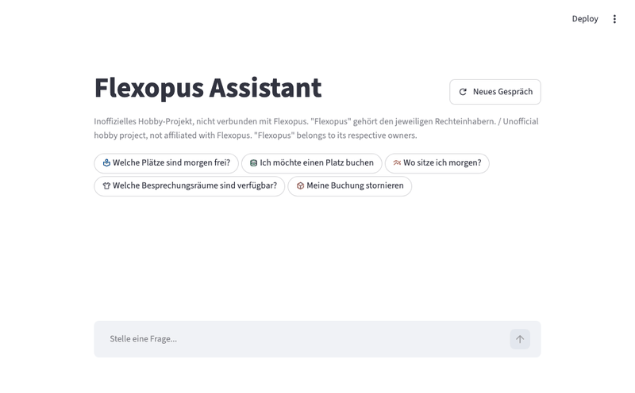

# Flexopus

Flexopus is a chat application for exploring Flexopus booking data with an LLM-backed assistant.
It combines a FastAPI backend, LangChain tools, and a Streamlit UI so users can ask questions about
buildings, locations, bookables, bookings, and user records.



## Disclaimer

This is an **unofficial, non-commercial hobby project**, built for fun and to explore LLM agents
on top of a real-world booking API. It is **not affiliated with, endorsed by, or sponsored by
Flexopus** in any way. "Flexopus" and any related names, logos, and trademarks are the property of
their respective owner(s) and are used here only to describe the product this project integrates
with.

The code is provided free of charge, "as is", without warranty of any kind, and is not intended
for commercial or production use. Use at your own risk, and bring your own Flexopus/Gemini
credentials.

## About Flexopus

[Flexopus](https://flexopus.com) is a third-party workplace-management platform for booking desks,
rooms, and other shared resources across buildings and locations. This project talks to a
Flexopus instance's public API to let a chat assistant answer questions and make bookings on a
user's behalf - it does not modify, replace, or resell any part of Flexopus itself.

## What It Does

- Answers questions about Flexopus resources in natural language.
- Streams assistant responses into the UI.
- Supports human-in-the-loop approval for selected tool calls.
- Exposes multiple Flexopus API tools for buildings, locations, occupancy, availability, and users.

## Project Layout

- `src/api`: FastAPI app, request/response schemas, and route handlers.
- `src/application`: application-level services that orchestrate the conversation flow.
- `src/llm`: agent setup, prompts, state helpers, and Flexopus tool implementations.
- `src/ui`: Streamlit frontend, chat rendering, and backend API client.

## How to Run

The project uses Python 3.13.

### Configuration

Copy `.env.example` to `.env` and fill in what you need:

```bash
cp .env.example .env
```

`BACKEND_API_URL` is the only variable the app actually requires (the Streamlit UI won't start
without it). The UI asks each user for their Flexopus API key, Flexopus URL, and Gemini API key at
the start of the session, so `FLEXOPUS_API_TOKEN` / `FLEXOPUS_API_URL` / `GOOGLE_API_KEY` in `.env`
are only used as a server-side fallback if a user skips that form. Everything else in
`.env.example` (LangSmith tracing, deepeval) is optional and only relevant for
tracing or running `evals/` locally.

### Local Run

Install the dependency groups first:

```bash
uv sync --locked --group api --group ui
```

Start the backend from `src/api`:

```bash
cd src/api
uv run fastapi dev main.py
```

Start the UI from `src/ui`:

```bash
cd src/ui
uv run streamlit run app.py
```

### Docker Build and Run

Each service has its own Dockerfile at the repo root and listens on `$PORT` (defaulting to
`8080`). Build and run them independently:

```bash
docker build -f Dockerfile.api -t flexopus-api .
docker run --env-file .env -p 8000:8080 flexopus-api
```

```bash
docker build -f Dockerfile.streamlit -t flexopus-ui .
docker run --env-file .env -e BACKEND_API_URL=http://host.docker.internal:8000/api -p 8501:8080 flexopus-ui
```

### Deploying to Cloud Run (GCP)

Deployment is handled by CI/CD, not manual `gcloud` commands. On every push to `main`,
[`.github/workflows/deploy.yml`](.github/workflows/deploy.yml) builds and pushes the backend and
frontend images to Artifact Registry, then runs `terraform apply` (`terraform/main.tf`) to roll
out `fastapi-backend` and `streamlit-frontend` as two Cloud Run services. The frontend's
`BACKEND_API_URL` is wired automatically from the backend service's live Cloud Run URL via
Terraform - no manual step needed there.

One-time setup (not automated, and shouldn't be - see `terraform/bootstrap/main.tf`'s comments for
why the CI identity deliberately can't do this itself): apply `terraform/bootstrap/` manually with
your own privileged GCP credentials to create the Artifact Registry repo, the
`github-actions-deployer` service account, and its IAM grants, then set `GCP_PROJECT_ID`,
`GCP_CREDENTIALS` (that service account's key), and `TF_STATE_BUCKET` as GitHub Actions secrets.
See `terraform/README.md` for the full split between `main.tf` (CI-managed) and `bootstrap/`
(manual, rare).

## Tooling

The agent currently includes tools for:

- listing buildings and groups
- searching users by email
- exporting all users as CSV
- listing bookings for buildings, locations, and bookables
- checking location occupancy
- checking bookable availability

Tool responses are typed with Pydantic models where the payload shape is stable enough to benefit from it.

## Human-in-the-Loop

Some tools can be paused for manual approval before they run.
When that happens, the UI shows the pending tool name and arguments, and you can approve or reject the action.

## Notes

- The UI keeps a `thread_id` per session so tool approvals can resume the same run.
- The project uses Ruff for linting and import sorting with a 100 character line length.
